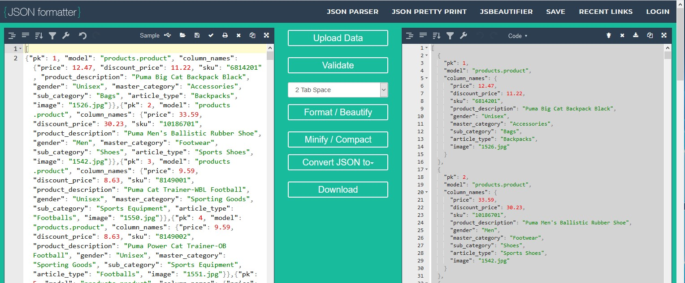

# Sportswear Online Fixtures JSON file Creation #


[Main README.md file](https://github.com/simonjvardy/Sportswear-Online/blob/main/README.md)


---

## Table of Contents ##

- [Introduction](#introduction)
- [products.json File creation](#products.json-file-creation)
  - [Curate the images](#curate-the-images)
  - [Create the products.json fixtures file](#create-the-products.json-fixtures-file)


---

## Introduction ##

The data set for this project was sourced from the [Fashion Product Image Dataset](https://www.kaggle.com/paramaggarwal/fashion-product-images-dataset) containing 44,440 (13.8GB) of image files along with 44,440 associated JSON files relating to each image containing highly detailed product information.

The images needed to be curated down to a manageable number for this project and only sportwear related images were selected.

---

## products.json File creation ##

### ***Curate the images*** ##

The dataset contained a full list of filenames in a csv file which was used to create the final list of images and JSON files to be used for this project.


The filtered list of id codes was used to create a python utility app ([move_files.py](utilities/move_files.py)) to move the required list of source product JSON files into a new local folder.

The total number of images in the curated dataset was reduced to 212 images along with their associated JSON files.

```Python
import shutil
import os

src = r"D:\\FashionProductImageDataSet\\fashion-dataset\\styles\\"
dest = r"D:\\FashionProductImageDataSet\\fashion-dataset\\curated_json\\"

# read list of filenames to copy
# https://stackoverflow.com/questions/3277503/how-to-read-a-file-line-by-line-into-a-list
with open(r"D:\FashionProductImageDataSet\fashion-dataset\file_list.txt", "r") as f:
    src_files = [line.rstrip('\n') for line in f]

files_count = 0

# Copy the selected files from the list into the destination folder
# https://stackoverflow.com/questions/3397752/copy-multiple-files-in-python/3399299
for file_name in src_files:
    full_filename = os.path.join(src, file_name)
    print(full_filename)
    if os.path.isfile(full_filename):
        shutil.copy(full_filename, dest)
        files_count += 1

print("Files copied:", files_count)

```


### ***Create the products.json fixtures file*** ###

The source JSON files contained extremely detailed product information and was far more than required for this project.

However, they did contain all the required name value pairs needed for the Sportswear Online products model.

To extract only the required data from each of the 212 JSON files, another Python utility app ([create_json.py](utilities/create_json.py)) was created to open and read all of the source JSON files from the local file directory and to loop through each one to extract the required name value pairs; appending the data to products.json fixtures file.

```Python
"""
Open multiple files in a directory:
    https://stackoverflow.com/questions/38991923/how-to-open-multiple-files-in-a-directory/38992988
Appending data to a file:
    https://thispointer.com/how-to-append-text-or-lines-to-a-file-in-python/
"""

import json
import os

json_path = r"D:\\FashionProductImageDataSet\\fashion-dataset\\curated_json\\"


def json_data(path):
    """
    Function to extract JSON file product data from kaggle.com data set
    to fit the Sportswear Online product model and fixtures JSON file format
    """
    pk = 1
    filelist = os.listdir(path)

    # write the data to a JSON file
    for i in filelist:
        if i.endswith(".json"):
            with open(path + i, "r") as f:
                json_data = json.load(f)

                """
                Source JSON file prices are in Indian Rupees
                Convert prices to GBP for the JSON output
                """
                price = json_data['data']['price']
                price_new = float("{:.2f}".format(price * 0.0096))

                """
                Convert prices to GBP for the JSON output and add an extra
                10% discount
                """
                discount_price = json_data['data']['discountedPrice']
                discount_price_new = float("{:.2f}".format(
                    (discount_price * 0.0096) * 0.90))

                # Build the products JSON structure
                json_data = {
                    "pk": pk,
                    "model": "products.product",
                    "column_names": {
                        "price": price_new,
                        "discount_price": discount_price_new,
                        "sku": json_data['data']['articleNumber'],
                        "product_description": json_data['data']['productDisplayName'],
                        "gender": json_data['data']['gender'],
                        "master_category": json_data['data']['masterCategory']['typeName'],
                        "sub_category": json_data['data']['subCategory']['typeName'],
                        "article_type": json_data['data']['articleType']['typeName'],
                        "image": str(json_data['data']['id']) + ".jpg",
                    }
                }

                # write the data to a JSON file
                with open('products.json', 'a') as json_file:
                    json.dump(json_data, json_file)

                pk += 1


json_data(json_path)

```
The source dataset was originally for an online store website based in India so the prices needed to have an exchange rate from Rupees to GBP applied as part of the data export.


Unfortunately, the output file data isn't in true JSON format so the full list of JSON objects was copied into [JSON Formatter](https://jsonformatter.org/) and the "Repair JSON" and Format / Beautify functions were applied.




This data was copied back into [products.json](products/fixtures/products.json)

 ---

