# Sportswear Online Project Testing Details #


[Main README.md file](https://github.com/simonjvardy/Sportswear-Online/blob/main/README.md)

[View the live project here.](http://sportswear-online.herokuapp.com/)

---

## Table of Contents ##

- [Sportswear Online Project Testing Details](#sportswear-online-project-testing-details)
  - [Table of Contents](#table-of-contents)
  - [Automated Testing](#automated-testing)
    - [Test Driven Development (TDD)](#test-driven-development-(tdd))
    - [Validation Services](#validation-services)
  - [Manual Testing](#manual-testing)
    - [Unit Testing](#unit-testing)
    - [Testing undertaken on desktop](#testing-undertaken-on-desktop)
    - [Testing undertaken on tablet and phone devices](#testing-undertaken-on-tablet-and-phone-devices)
  - [Bugs discovered](#bugs-discovered)


---
## Automated Testing ##

### Test Driven Development (TDD) ###


[Django unittest documentation](https://docs.djangoproject.com/en/3.2/topics/testing/overview/)

Using Django's standard unit test library module `unittest`, a class based approach was used to build tests for each app's functionality.

For each app in the project, where applicable, the following files were tested:
  - `views.py` tested by `test_views.py`
  - `models.py` tested by `test_models.py`
  - `forms.py` tested by `test_forms.py`


### Validation Services ###

The following **validation services** and **linters** were used to check the validity of the website code.

- [W3C CSS Validation Service](https://jigsaw.w3.org/css-validator/)
  - This validator checks the validity of cascading style sheets (css) and (X)HTML documents with style sheets.
  - All css files passed the validation service. However, base.css passes with some warnings:

    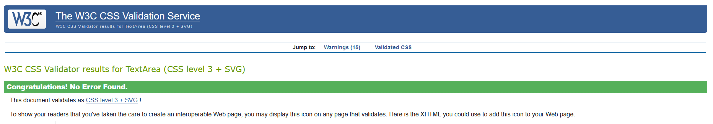

    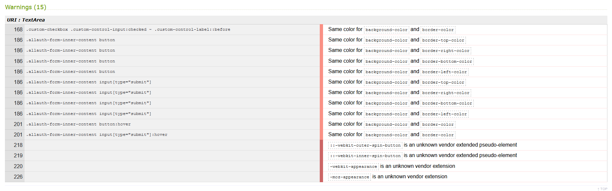

  - The warnings are related to:
    1. Allauth buttons styling borrowed from the Boutique Ado mini project. The default button was restyled to be a black submit button which has the same colour border.
    2. The following code snippet was copied from [W3Schools.com](https://www.w3schools.com/howto/howto_css_hide_arrow_number.asp) as a way to hide the up & down arrows / number spinners on the products page & shopping cart item quantity field. This provided a cleaner input filed with just the +/- buttons at the ends of the field.

    ```CSS
    /* Chrome, Safari, Edge, Opera */
    input::-webkit-outer-spin-button,
    input::-webkit-inner-spin-button {
      -webkit-appearance: none;
      margin: 0;
    }

    /* Firefox */
    input[type=number] {
      -moz-appearance: textfield;
    }
    ```

- [W3C Markup Validator](https://validator.w3.org/)
  - This validator checks the markup validity of Web documents in HTML, XHTML, SMIL, MathML, etc.

  - Home:
    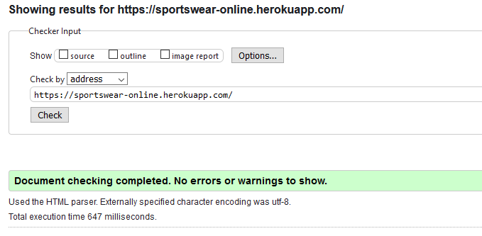

  - Products:
    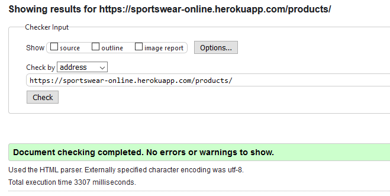

  - Product Page:
    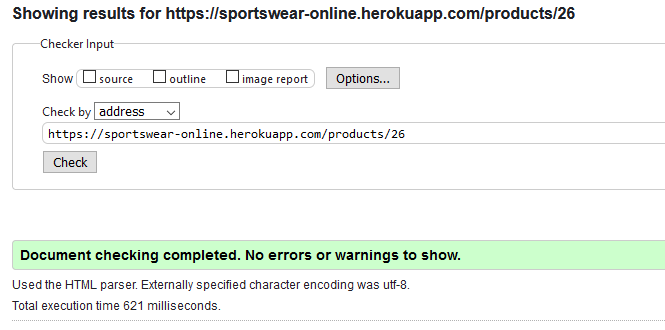

  - Add Product:
    

  - Edit Product:
    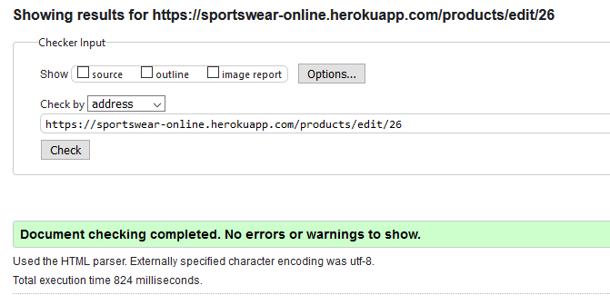

  - cart:
    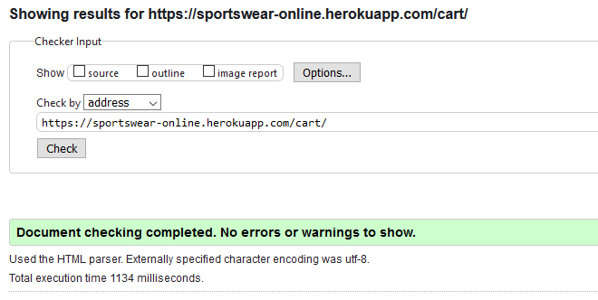

  - Checkout:
    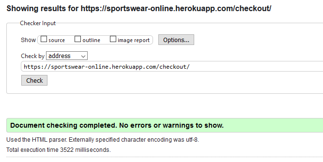

  - Profile:
    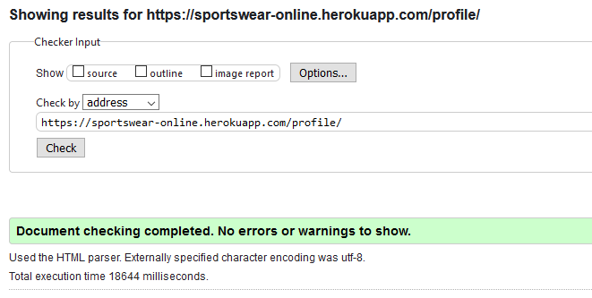

  - Register:
    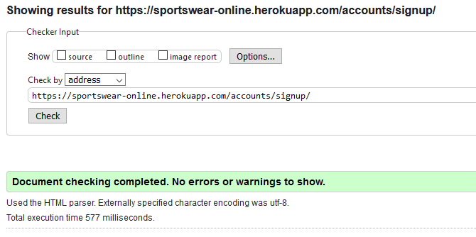

  - Login:
    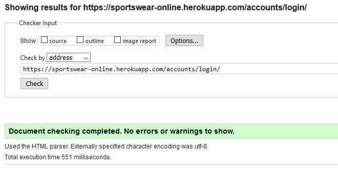


- [Flake8 Python Lintier](http://pep8online.com/checkresult)
  - This VSCode extension linter checks the validity of Python code against the PEP8 requirements. The code is reviewed and refactored during development.

- [Chrome DevTools Lighthouse](https://developers.google.com/web/tools/lighthouse)
  - An open-source automated tool for improving webpages by running audits for performance, accessibility, progressive web apps, SEO etc.

  - Desktop Performance
    
  
  - Mobile Performance
    

  - GitHub [Issue #80](https://github.com/simonjvardy/Sportswear-Online/issues/80) describes the problem with site performance experienced after deployment to Heroku and serving the media & static files from an AWS S3 bucket. The performance drop was noticeable from the development environment with the same static files.

---
## Manual Testing ##

### Unit Testing ###
[Unit Testing document](testing/MS3-unit-test-plan.pdf) containing:
- Unit Test scope,
- The test cases,
- The pass / fail record for each test case.


### Testing undertaken on desktop ###

- Hardware:
    - Macbook Pro Laptop 17" (2009)
    - Dell 5590 Laptop
- Tested Operating Systems:
    - Windows 10
    - OSX 10.11 
- Tested Browsers:
    - Windows 10:
        - Chrome
        - Firefox
        - Edge 
    - OSX 10.11
        - Chrome
        - Firefox
        - Safari

### Testing undertaken on tablet and phone devices ###

- Hardware:
    - iPad Pro 12.9"
    - iPad Pro 10.5"
    - iPhone XS Max
- Tested Operating Systems:
    - iOS 14.5
    - iPadOS 14.5
- Tested Browsers:
    - iOS / iPadOS
        - Chrome
        - Firefox
        - Edge
        - Safari

---
## Bugs discovered ##

The issue log is managed on the [GitHub Project Issues section](https://github.com/simonjvardy/Sportswear-Online/issues) using the standard GitHub [bug\_report.md template](https://github.com/simonjvardy/Sportswear-Online/blob/main/.github/ISSUE_TEMPLATE/bug_report.md)

The issues are logged within GitHub and linked to the [Bug Fixes](https://github.com/simonjvardy/Sportswear-Online/projects/2) Project.

When an issue is resolved, it is linked to the pull request containing to the committed code, which closes the issue along with the pull request.


### Bugs Overview ###

There were 27 bug reported during unit testing of the site. Please visit the GitHub repository [closed issues](https://github.com/simonjvardy/Sportswear-Online/issues?q=is%3Aissue+is%3Aclosed) or click on the issue number links below for more detailed troubleshooting information and associated pull requests.

A selection of the reported bugs are briefly described here:

[Issue #80](https://github.com/simonjvardy/Sportswear-Online/issues/80)
- **Unit Testing: Deployed Heroku site very poor Google Lighthouse performance**
  - After deploying to Heroku and loading the static / media files to an AWS S3 bucket, running Goole DevTools Lighthouse showed a dramatic drop in performance score. Site load times were weel above 10s.
  - Testing the site with differing amounts of product images showed the performance score change relation to the number of images displayed.

Various Django errors:

[Issue #52:](https://github.com/simonjvardy/Sportswear-Online/issues/52)
- **Unit Test: Django Error "AttributeError at /checkout/ 'NoneType' object has no attribute 'split'"**

[Issue #45:](https://github.com/simonjvardy/Sportswear-Online/issues/45)
- **Unit Test: Django error "NoReverseMatch at /checkout/ Reverse for 'product_detail' not found. 'product_detail' is not a valid view function or pattern name."**

[Issue #44:](https://github.com/simonjvardy/Sportswear-Online/issues/44)
- **Unit Test: Django error "NoReverseMatch at /checkout/ Reverse for 'cart' not found. 'cart' is not a valid view function or pattern name."**

[Issue #43:](https://github.com/simonjvardy/Sportswear-Online/issues/43)
- **Unit Test: Django error "TemplateSyntaxError at /checkout/ Invalid filter: 'calc_subtotal'"**

[Issue #42:](https://github.com/simonjvardy/Sportswear-Online/issues/42)
- **Unit Test: Django error "TemplateSyntaxError at /checkout/ Could not parse the remainder: ''checkout/css/checkout.css'' from '.'checkout/css/checkout.css''**

[Issue #41:](https://github.com/simonjvardy/Sportswear-Online/issues/41)
- **Unit Test: Django error "TemplateDoesNotExist at /checkout/ checkout/checkout.html"**

[Issue #40:](https://github.com/simonjvardy/Sportswear-Online/issues/40)
- **Unit Test: Django error "NoReverseMatch at /cart/ Reverse for 'checkout' not found. 'checkout' is not a valid view function or pattern name."**

[Issue #35:](https://github.com/simonjvardy/Sportswear-Online/issues/35)
- **Unit Test: Django error "TemplateSyntaxError at /cart/ 'cart_tools' is not a registered tag library."**

[Issue #33:](https://github.com/simonjvardy/Sportswear-Online/issues/33)
- **Unit Test: Django error "TypeError at /cart/update/1/" when entering zero as the update cart qty**

[Issue #29:](https://github.com/simonjvardy/Sportswear-Online/issues/29)
- **Unit Test: Django error "ValueError at cart/add/1/" - having a blank product item quantity field causes an error**

[Issue #20:](https://github.com/simonjvardy/Sportswear-Online/issues/20)
- **Unit Test: Django error "FieldError at /products/ Cannot resolve keyword 'lower_name' into field."**

[Issue #17:](https://github.com/simonjvardy/Sportswear-Online/issues/17)
- **Unit Test: Django error "FieldError at /products/ Cannot resolve keyword 'master' into field"**

[Issue #15:](https://github.com/simonjvardy/Sportswear-Online/issues/15)
- **Unit Test: Django error "UnboundLocalError at /products'"**

[Issue #14:](https://github.com/simonjvardy/Sportswear-Online/issues/14)
- **Unit Test: Django "FieldError at /products/ Related Field got invalid lookup: icontains"**
